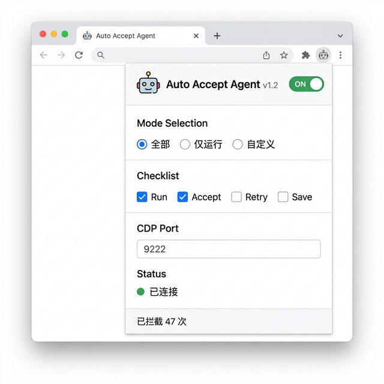

# Auto Accept Agent

[English](README_EN.md) | **中文**

适用于 VS Code / Antigravity / Cursor 的扩展，通过 Chrome DevTools Protocol 与 IDE 前端通信，自动识别并点击 AI 代理发出的操作按钮（如运行、接受、重试等），减少人工干预。

---

## 工作原理

扩展启动时通过进程树向上遍历，检测父进程的 `--remote-debugging-port` 参数以获取 CDP 端口号。建立 WebSocket 连接后，向目标页面注入 JavaScript 脚本，定时扫描 DOM 中符合预设模式的按钮并触发点击。

核心流程：

```
扩展激活 → 检测 CDP 端口 → WebSocket 连接 → 注入脚本 → 轮询点击
```

### 状态管理

采用三层状态模型分离用户意图与系统能力：

| 状态 | 含义 | 持久化 |
|------|------|--------|
| `userWantsEnabled` | 用户是否希望启用 | globalState |
| `cdpAvailable` | CDP 连接是否可用 | 运行时 |
| `isRunning` | 轮询是否活跃 | 运行时 |

当用户启用但 CDP 不可用时进入 BLOCKED 状态，再次点击触发配置向导而非关闭。

### 端口检测

按优先级依次尝试：

1. VS Code 配置项 `autoAccept.cdpPort`
2. 父进程命令行参数（Windows 通过 WMI 查询进程树，macOS 通过 `ps` 命令，Linux 读取 `/proc/[pid]/cmdline`）
3. `process.argv` 中的 `--remote-debugging-port`
4. 环境变量 `ELECTRON_REMOTE_DEBUGGING_PORT`

### 按钮匹配

在注入的脚本中，通过以下步骤判断是否触发点击：

1. 从可配置的 `acceptPatterns` 中进行文本匹配（如 `run`、`accept`、`retry`）
2. 排除负面模式（如 `skip`、`cancel`、`discard`、`deny`）
3. 验证元素可见性（`display`、`visibility`、`opacity`、`getBoundingClientRect`）
4. 验证可交互性（`pointer-events`、`disabled` 属性）

### 安全策略

内置命令黑名单拦截机制，默认拦截以下模式：

```
rm -rf /    rm -rf ~    rm -rf *    format c:    del /f /s /q
rmdir /s /q    :(){:|:&};:    dd if=    mkfs.    > /dev/sda    chmod -R 777 /
```

Pro 用户可通过设置面板自定义黑名单。

---

## 功能

- 14 种可配置的自动接受操作类型（run, accept, retry, apply, execute, resume, confirm 等）
- 后台模式：通过 CDP 管理多个标签页的 WebSocket 连接，同时处理多个对话
- 实例互斥锁：多窗口场景下通过 `globalState` 协调，只允许一个实例控制 CDP
- 窗口状态感知：监听 `onDidChangeWindowState`，窗口恢复焦点时检查离开期间的操作统计
- ROI 数据统计：按周记录自动点击次数、节省时间、阻断次数，支持周报通知
- 快捷方式自动配置：Windows 下自动修改 `.lnk` 快捷方式和注册表上下文菜单项，macOS 下通过 `osacompile` 创建启动器，Linux 下修改 `.desktop` 文件
- i18n 国际化：基于 VS Code L10n API，支持英文和简体中文，可通过配置项强制切换

---

## 安装

1. 下载 `.vsix` 文件
2. 打开 IDE → `Ctrl+Shift+P` → `Install from VSIX`
3. 选择文件并重启 IDE

### 首次配置

扩展需要 IDE 以 `--remote-debugging-port=9000` 参数启动。首次点击启用时，扩展会尝试自动修改系统快捷方式添加此参数。也可以手动配置：

**Windows** — 右键快捷方式 → 属性 → 目标后追加 `--remote-debugging-port=9000`

**macOS** — 终端执行 `open -a "Antigravity.app" --args --remote-debugging-port=9000`

**Linux** — 编辑 `.desktop` 文件的 `Exec=` 行，在末尾追加参数

---


### 设置面板



## 配置

| 配置项 | 类型 | 默认值 | 说明 |
|--------|------|--------|------|
| `autoAccept.cdpPort` | `integer \| null` | `null` | CDP 端口号，`null` 为自动检测 |
| `autoAccept.autoAcceptFileEdits` | `boolean` | `true` | 是否自动接受文件编辑 |
| `autoAccept.languageOverride` | `string` | `auto` | 界面语言（`auto` / `en` / `zh-cn`） |
| `autoAccept.overlayMode` | `string` | `none` | 后台模式 Overlay 显示（`none` / `panel` / `minimal`） |
| `autoAccept.localVipOverride` | `boolean` | `false` | 强制本地 Pro 模式（调试用） |

操作类型配置通过设置面板的多选界面完成，数据存储在 `globalState` 中。

---

## 项目结构

```
├── extension.js           # 扩展入口，状态管理和命令注册
├── settings-panel.js      # WebView 设置面板
├── config.js              # Stripe 支付链接配置
├── main_scripts/
│   ├── cdp-handler.js     # CDP 连接管理，WebSocket 通信
│   ├── full_cdp_script.js # 注入浏览器端的完整脚本
│   ├── auto_accept.js     # 按钮识别和点击逻辑
│   ├── relauncher.js      # 跨平台快捷方式修改
│   ├── overlay.js         # 后台模式 Overlay UI
│   ├── selector_finder.js # CSS 选择器查找
│   └── utils.js           # 工具函数
├── utils/
│   └── localization.js    # i18n 国际化管理
├── l10n/                  # 语言包文件
└── test_scripts/          # 测试脚本
```

---

## 兼容性

| 平台 | IDE 支持 | 端口检测方式 |
|------|----------|-----------|
| Windows | VS Code, Antigravity, Cursor | WMI 进程树遍历 |
| macOS | VS Code, Antigravity, Cursor | `ps` 命令遍历 |
| Linux | VS Code, Antigravity, Cursor | `/proc` 文件系统 |

支持多窗口、多实例（通过 globalState 实例锁协调）、最小化和失焦状态。

---

## 许可证

[MIT](LICENSE.md)